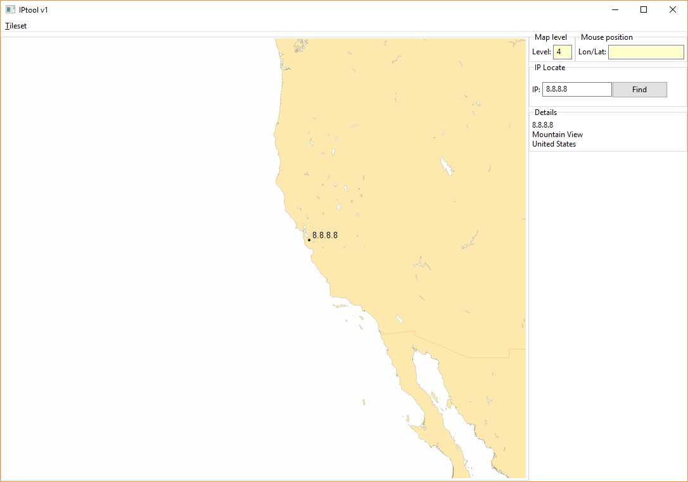

# Geo IP Tool

Tested on Windows 10 with Python 2.7.10

## Requirements:  
- Python 2.7  
- Requests (http://docs.python-requests.org/en/master/)  
- pyslip  
- wxPython 2.x (pyslip dependency)  

To use, run "python iptool.py"

This product includes GeoLite2 data created by MaxMind, available from http://www.maxmind.com
